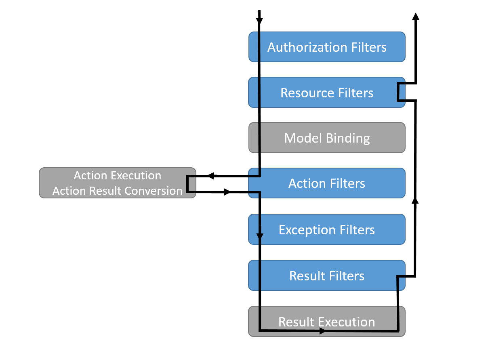
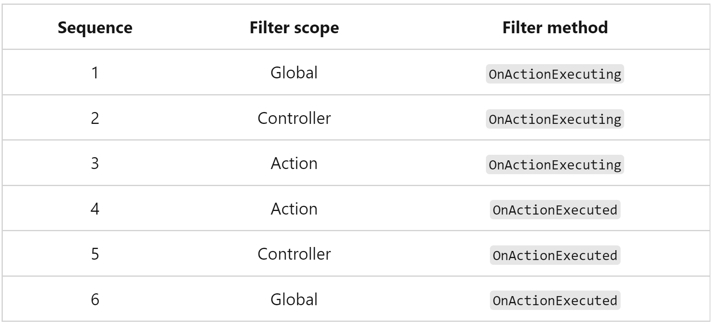

# Filter types
Each filter type is executed at a different stage in the filter pipeline:

`Authorization filters:`

* Run first.
* Determine whether the user is authorized for the request.
* Short-circuit the pipeline if the request is not authorized.

`Resource filters:`

* Run after authorization.
* OnResourceExecuting runs code before the rest of the filter pipeline. For example, OnResourceExecuting runs code before model binding.
* OnResourceExecuted runs code after the rest of the pipeline has completed.

`Action filters:`

* Run immediately before and after an action method is called.
* Can change the arguments passed into an action.
* Can change the result returned from the action.
* Are not supported in Razor Pages.

`Endpoint filters:`

* Run immediately before and after an action method is called.
* Can change the arguments passed into an action.
* Can change the result returned from the action.
* Are not supported in Razor Pages.
* Can be invoked on both actions and route handler-based endpoints.
* Exception filters apply global policies to unhandled exceptions that occur before the response body has been written to.

`Result filters:`

* Run immediately before and after the execution of action results.
* Run only when the action method executes successfully.
* Are useful for logic that must surround view or formatter execution.

> # The following diagram shows how filter types interact in the filter pipeline:

> # The following example illustrates the order in which filter methods run for synchronous action filters:
