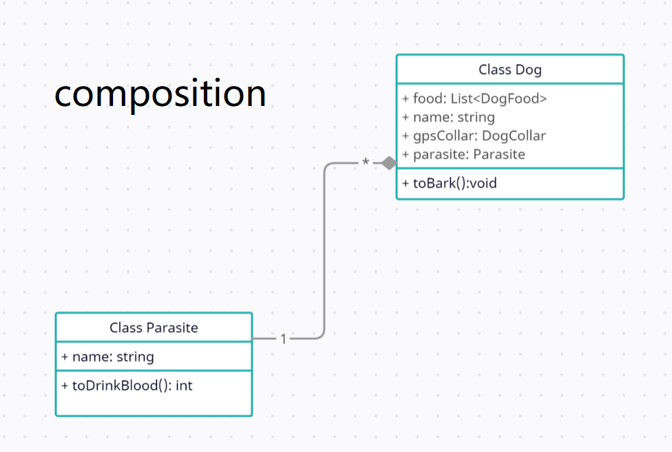

# UML DIAGRAMS
The UML Class diagram is a graphical notation used to construct and visualize object oriented systems. A class diagram in the Unified Modeling Language (UML) is a type of static structure diagram that describes the structure of a system by showing the system's
=
> # Class Visibility & basic example

> # Inheritance

> # Association

> # Composition

> # Aggregation

> # Dependency

> # Realization

> # Cardinality

> # FULL EXAMPLE
